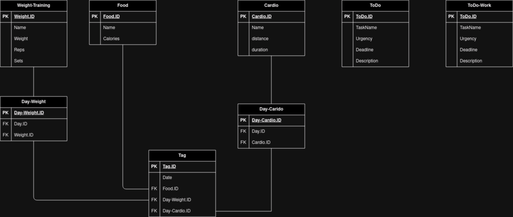

$\text{\color{teal}{\Huge HESTIA}}$
> [!IMPORTANT]
> Dieses Projekt ist noch im Aufbau
## Was ist das Projekt Hestia:
Ich möchte gerne eine eigene Applikation schreiben, um meinen Tag besser zu organisieren sowie eine Übersicht über die vergangenen Tage erhalten.

## Wie wird mein Programm geschrieben:
Bei dem Projekt Hestia handelt es sich um eine Webapplikation. Diese beinhaltet ein Frontend sowie ein Backend. 
### Backend:
Mein Backend enthält eine Postgres Datenbank. Geplant ist die Datenbank so:

### Frontend
Mein Frontend wird mit PUG und Node.js geschrieben.

# To Do
## DB Diagramm anpassen:
- [ ]  Food --> + Proteine 
- [ ]  Weight-Training --> Weight
- [ ] Tag --> Day (auch ID anpassen)